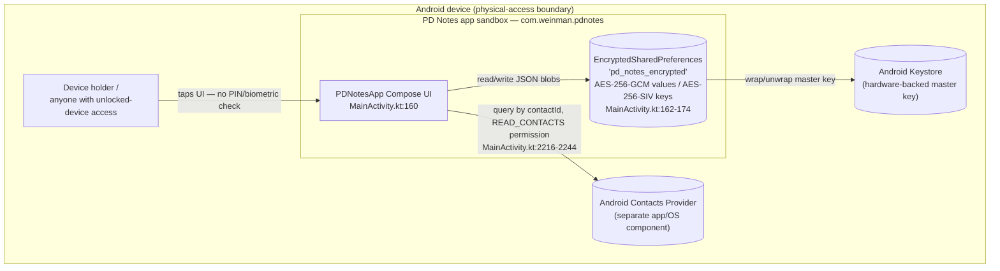
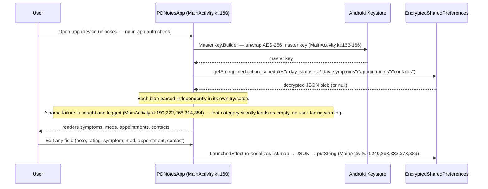
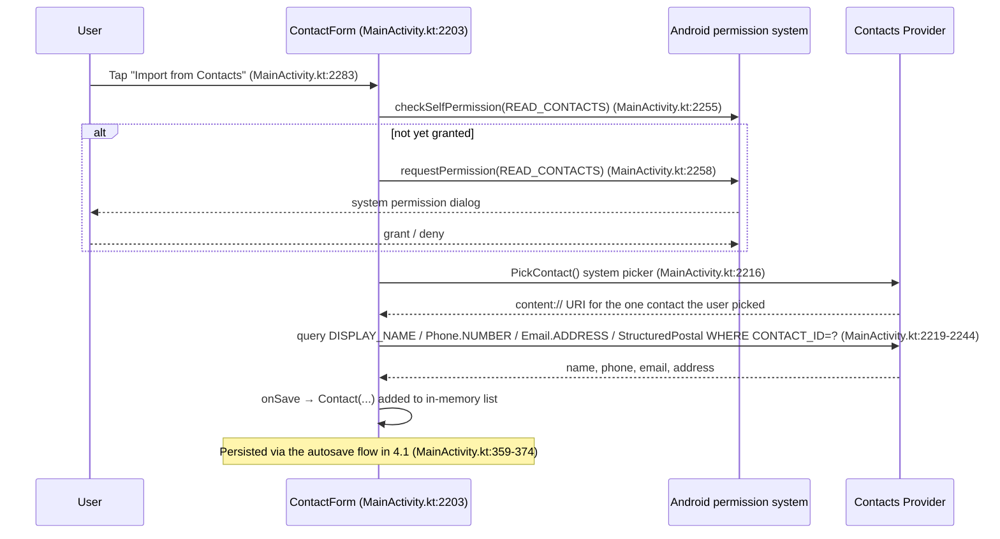

# Threat Model: PD Notes (Android)

> Generated 2026-07-23. Based on the artifacts listed under *Scope*. Threats are grounded in specific artifacts; unresolved gaps are listed under *Open Questions*.

## 1. System overview

PD Notes (Android) is a fully offline, single-user Parkinson's Disease tracking app. There is no backend, no network calls, and no server component of any kind — the app is a single Kotlin/Compose activity that stores everything locally in `EncryptedSharedPreferences`. The data worth attacking is the user's own health record: daily symptom severity, medication schedules, appointment details, and imported healthcare-contact information (name/phone/email/address of doctors etc.). There is no multi-tenant, multi-user, or cloud-sync concern — the entire attack surface is "someone or something with access to this one device or this one app's sandbox."

## 2. Scope & artifacts analyzed

- **Analyzed:** `app/src/main/java/com/example/pdnotes/MainActivity.kt` (entire app logic, ~2430 lines), `app/src/main/AndroidManifest.xml`, `app/build.gradle.kts`, `.gitignore` / `PDNotesAndroid/.gitignore`, `keystore.properties` handling.
- **Not available / out of scope:** `PDNotesIOS/` and `PDNotesPackage/` (sibling platforms in the same repo, not reviewed here — user scoped this review to Android only). No CI/CD config was found for this module. No IaC — not applicable, there is no deployed infrastructure. `pdnotes-release.keystore` exists at the repo root but is git-ignored and not analyzed for content (its secrecy, not its content, is what matters here).

## 3. Architecture diagram

## 4. Data-flow diagram(s)

### 4.1 App launch, data load, and autosave

### 4.2 Importing a healthcare contact

## 5. Trust boundaries

- **Device holder ↔ App UI** — enforced by: nothing inside the app; relies entirely on the OS lock screen. Status: **gap** — no PIN/biometric/pattern check inside PD Notes itself, and no `FLAG_SECURE` on the window (confirmed absent by search of `MainActivity.kt`). See T1.
- **App sandbox ↔ on-disk storage** — enforced by: Android app-sandbox isolation + `EncryptedSharedPreferences` (AES-256-GCM/SIV) with the master key held in Android Keystore (`MainActivity.kt:162-174`). Status: **enforced** for a non-rooted device; residual risk on a rooted/compromised device (see T3).
- **App sandbox ↔ Contacts Provider** — enforced by: Android's `READ_CONTACTS` runtime permission (`AndroidManifest.xml:3`, requested at `MainActivity.kt:2250-2260`). Status: **enforced**, but the grant is broader than the single-contact `PickContact()` flow strictly needs (see T4).
- **App sandbox ↔ other apps / backup** — enforced by: `android:allowBackup="false"` (`AndroidManifest.xml:5`), and `MainActivity` being the only exported component (`AndroidManifest.xml:10`, required for the launcher; no other exported activities/services/providers exist). Status: **enforced**.

## 6. Assets

- Daily symptom/medication/exercise notes and severity ratings — `EncryptedSharedPreferences` keys `day_statuses`, `day_symptoms` (`MainActivity.kt:204-294`).
- Medication schedules — key `medication_schedules` (`MainActivity.kt:181-202`, `376-390`).
- Appointment details (date, time, location, notes) — key `appointments` (`MainActivity.kt:296-333`).
- Imported healthcare-contact PII (name, phone, email, address) — key `contacts` (`MainActivity.kt:335-374`).
- Master AES key protecting all of the above — Android Keystore, referenced via `MasterKey.Builder` (`MainActivity.kt:163-166`).
- Release-signing credentials — `PDNotesAndroid/keystore.properties`, read by `app/build.gradle.kts:8-11`; confirmed git-ignored, not committed.

## 7. Threats

| ID | Component (Ref) | STRIDE | Threat | Evidence | Impact | Likelihood | Rating | Mitigation status |
|----|-----------------|--------|--------|----------|--------|-----------|--------|-------------------|
| T1 | App UI (User ↔ UI) | I | No in-app authentication or screenshot protection — anyone with the unlocked device sees the full PD health record instantly | No lock/biometric code path anywhere in `MainActivity.kt`; no `FLAG_SECURE` set on the window | Medium | Medium | **Medium** | Missing — see 8.1 |
| T2 | EncryptedSharedPreferences (Prefs) | T/D | Corrupted or partially-written storage silently resets a data category to empty, with no backup/export/recovery path | Independent try/catch per category, each logs and drops on failure (`MainActivity.kt:199,222,268,314,354`); `allowBackup="false"` and no export feature exist | Medium | Medium | **Medium** | Missing — see 8.2 |
| T3 | Prefs ↔ Keystore | I | On a rooted/compromised device, the app process (or something with root) can invoke the same Keystore-backed key the app uses and read all stored health data | `EncryptedSharedPreferences`/`MasterKey` usage at `MainActivity.kt:162-174` — correct API, but Keystore protection is bypassed once the OS/root boundary is broken | High | Low | **Medium** | Already using the strongest standard mitigation (Keystore-backed AES-GCM/SIV); residual risk on rooted devices is accepted, not further mitigable at the app layer |
| T4 | Contacts Provider (UI → CP) | I | `READ_CONTACTS` grant is broader than the single-contact import flow needs — once granted, the app *could* query the entire contacts DB, not just the picked contact | `PickContact()` itself needs no permission; the supplemental by-ID queries at `MainActivity.kt:2223-2244` require the broad `READ_CONTACTS` permission requested at `MainActivity.kt:2258` | Low | Low | **Low** | Not mitigated; low priority given this is self-authored, non-networked code with no path for the broader grant to be abused today |

## 8. Threat detail

### 8.1 T1 — No in-app authentication / screenshot protection (Medium)
Attack path: `Device holder (with an unlocked phone) → PDNotesApp UI`, crossing the one trust boundary this app actually has — the OS lock screen — with zero additional check inside the app. Once the phone is unlocked (lost/stolen while unlocked, briefly handed over, or left unattended), opening PD Notes exposes the complete symptom history, medication list, appointment schedule, and doctor contact details with no further gate. Separately, because no `FLAG_SECURE` is set, Android's recent-apps switcher can show a thumbnail of the last-viewed screen (which may include symptom notes) to anyone who can see the unlocked device, without even opening the app.

**Mitigation (recommended, not yet present):**
1. Set `WindowManager.LayoutParams.FLAG_SECURE` in `MainActivity.onCreate()` (`MainActivity.kt:145`) — a one-line addition that blocks both screenshots and recent-apps thumbnails of this activity.
2. Add an optional app-level gate using `androidx.biometric.BiometricPrompt` (device biometric/PIN, backed by the same Keystore already in use) shown once per cold start/resume-after-background, gated behind a user-facing setting so it doesn't force a new dependency on everyone. This is additive to the existing lock screen, not a replacement for it, and keeps scope minimal — no new screen, no new persisted data beyond a boolean setting.

### 8.2 T2 — Silent data loss on storage corruption (Medium)
Attack path/failure mode: any interruption during `EncryptedSharedPreferences` writes (low storage, forced app-kill mid-write, or deliberate tampering by something with file access) can leave a stored JSON blob malformed. Each of the five load blocks (`MainActivity.kt:181-202, 204-225, 243-271, 296-317, 335-357`) catches `Exception`, logs it via `Log.e`, and silently continues with an empty list/map for that category — the user sees a blank screen for that data with no indication anything was lost. Because `allowBackup="false"` is set (correctly, for confidentiality) and there is no export/backup feature at all, this loss is unrecoverable. For a chronic-condition tracking app, silently losing months of symptom-trend data used to inform medical decisions is a meaningful integrity/availability failure even without an attacker in the loop.

**Mitigation (recommended):** surface a non-blocking warning (e.g. a `Snackbar`) when any of the five `catch` blocks fires, so the user knows a data category failed to load rather than assuming it's simply empty. This doesn't require building an export feature — just replacing silent `Log.e`-and-continue with a one-line user-visible signal at the same five call sites.

## 9. Open questions / unresolved assumptions

- **Target device range for Keystore hardware backing.** `minSdk = 24` (`app/build.gradle.kts:19`) allows installation on Android 7.0+ devices, some of which may lack StrongBox or a TEE-backed Keystore, weakening the practical strength of T3's existing mitigation on older/cheaper hardware. Not verified against a specific device fleet — no assumption made, flagged for awareness only.
- **Shared-device usage.** User confirmed this is a personal-device-only app (not shared with family/caregivers), which keeps T1's likelihood at Medium rather than High. If usage patterns change (e.g. handed to a caregiver regularly), T1 should be re-rated upward.
- **`pdnotes-release.keystore` at the repo root.** Confirmed present on disk but git-ignored and not committed (`git ls-files` shows no match). Its actual secrecy/handling outside the repo (e.g. where backups of this file live) was not reviewed — out of scope for a code-based threat model.
